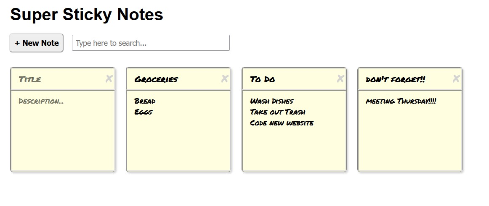

# Skillcrush - Sticky Note UI Project

This is the code for the [Skillcrush Sticky Note UI Project](https://learn.skillcrush.com).

## Table of contents

- [Overview](#overview)
  - [The project](#the-project)
  - [Screenshot](#screenshot)
  - [Links](#links)
- [My process](#my-process)
  - [Built with](#built-with)
  - [Continued development](#continued-development)
- [Author](#author)
- [Acknowledgments](#acknowledgments)

## Overview

### The project

Users should be able to:

- Create new sticky notes
- Write/edit the title and description fields of existing sticky notes
- Search their sticky notes
- Refersh/close their browser and retain their sticky notes

### Screenshot

### Links

- GitHub URL: [https://github.com/amidona/sticky-note-ui](https://github.com/amidona/sticky-note-ui)
- Live Site URL: [https://vpuvtc.csb.app/](https://vpuvtc.csb.app/)

## My process

### Built with

- Semantic HTML5 markup
- CSS custom properties
- [React](https://reactjs.org/) - JS library

### Continued development

If I was going to spend more time on this, I'd like to work on the visual aspect (this project was solely focused on building with React). The final design is functional but pretty aestetically displeasing.

## Author

- Website - [Allyce Amidon](https://allyceamidon.com/)
- GitHub - [@amidona](https://github.com/amidona)
- CodeSandbox - [@amidona](https://codesandbox.io/u/amidona)

